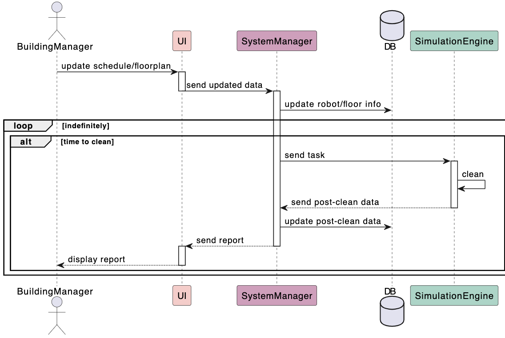
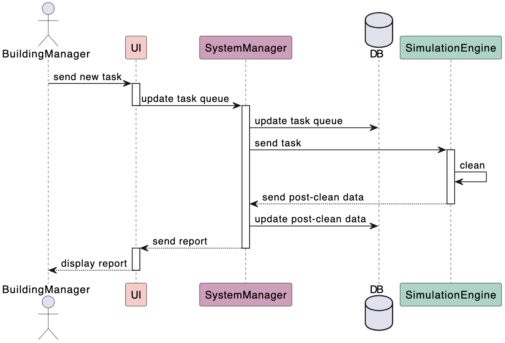
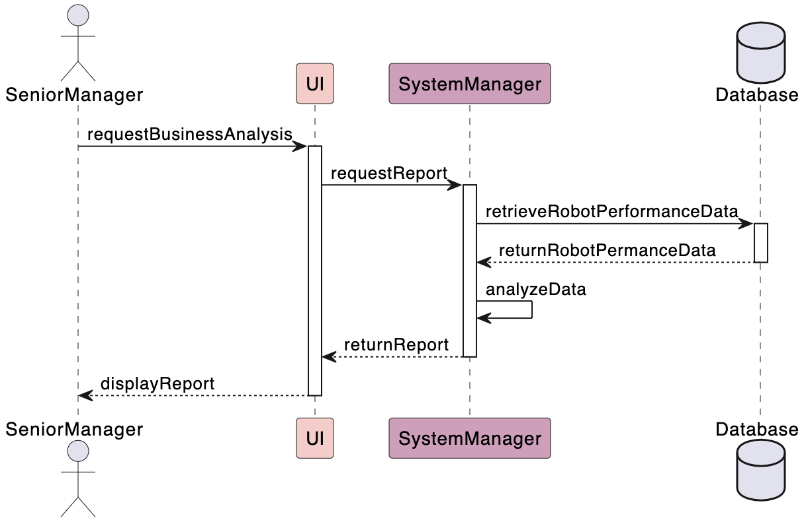
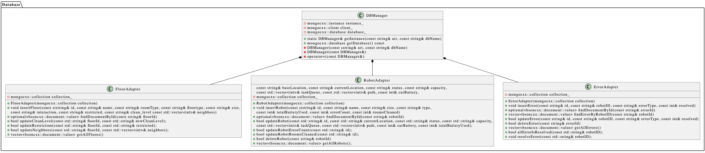
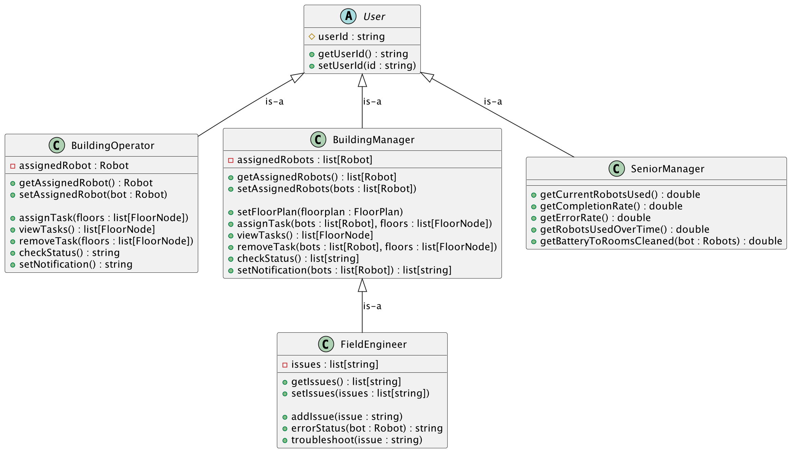
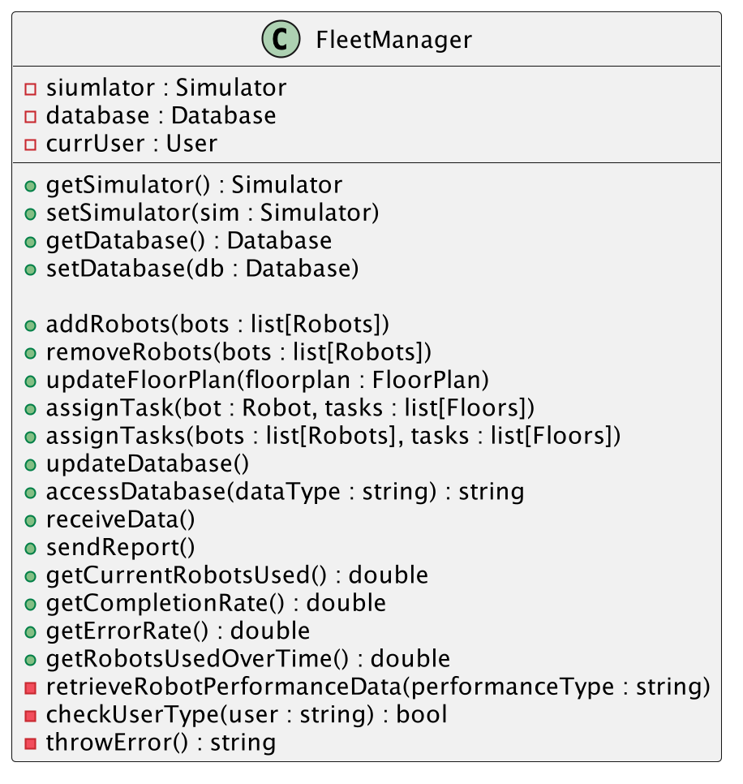

# Design Document

## Use Case Diagram

The use case diagram illustrates how the Senior Manager, Building Operator, Building Manager, and Field Engineer interact with the cleaning robot fleet management system. Each user has specific functionalities, such as assigns tasks to robots, setting a cleaning schedule or tracking robot location. Some functions are shared between roles.

## Architectural Design

There are 4 main components that make up the architecture: user interface, fleet manager, simulation, and database. There are sub-components in each that interact with other sub-components from the main components.

## User Interface
Below, we have the UI designs for the four different user roles.

### UI Senior Manager

### UI Building Operator

### UI Building Manager/Field Manager

### UI Field Manager

## Sequence Diagrams

This sequence diagram above shows the interactions between the building manager and each of the main components when the building manager is trying to change the schedule of the robots or update the floorpan.

This sequence diagram above shows the interactions between the building manager and each of the main components when the building manager is trying to start/change a task for the robots in the simulation.

This sequence diagram above shows the interactions between the building operator and each of the main components when the building manager is trying to start/change a task for a robot in the simulation.

This sequence diagram above shows how the system components interact when a field engineer receives a robot maintenance alert, starting with the simulation engine detecting the issue and ending with the UI displaying the alert after communication between the system manager and the database.

This sequence diagram above depicts how the system components interact when a senior manager requests a business analysis of robots, starting with the request through the UI and ending with the UI displaying the report after the system manager retrieves and processes the data from the database.

## UML Classes
The system consists of four main components: the **Simulation Engine** simulates a cleaning environment, the **Database** manages data interactions with MongoDB, the **Users** component defines various roles with specific permissions, and the **Management System** coordinates all interactions between the simulation, database, and user interface.

