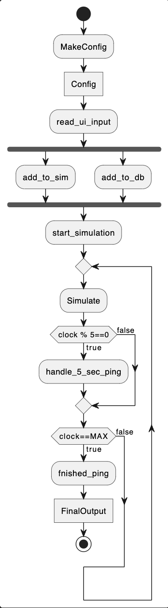

# Activity Diagrams
_Note: These activity diagrams are only a representation of the work completed during sprint 2 and the demo created during this time_

_Note: For this diagram puml formatted the arrow going back to simlaute a bit funky. However, it only when means clock!=max it will return to Simulate, it will not wait to check if true_

This activity diagram illustrates the interactions between the UI (config file), fleet manager, simulator, and database. The process begins with the creation of a config file. The fleet manager then reads the UI input, adding robots, rooms, and tasks to both the database and the simulator. Once the simulation starts, the simulator updates the fleet manager on the robot statuses every 5 ticks, and the fleet manager displays this information in the terminal. When the maximum simulation time is reached, a `finished_ping` event is triggered, ending the simulation and outputting the final results to a text file.

This activity diagram applies to both user stories being demonstrated, as the only difference between the building manager and building operator roles is the number of robots they can control (many vs. one).