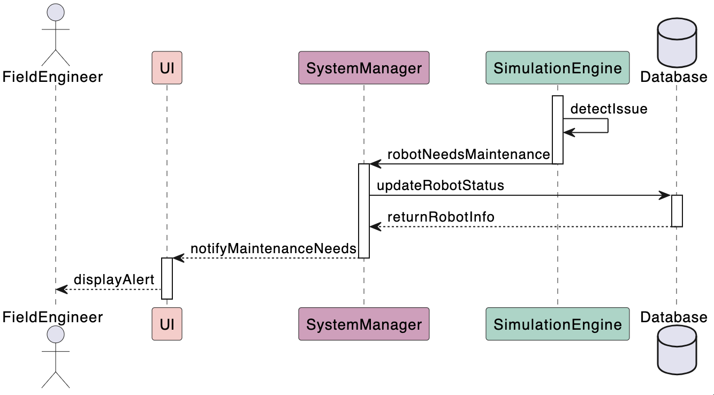
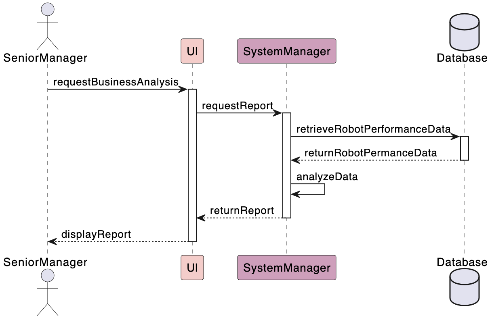
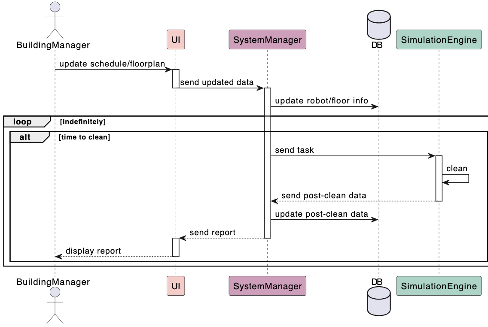
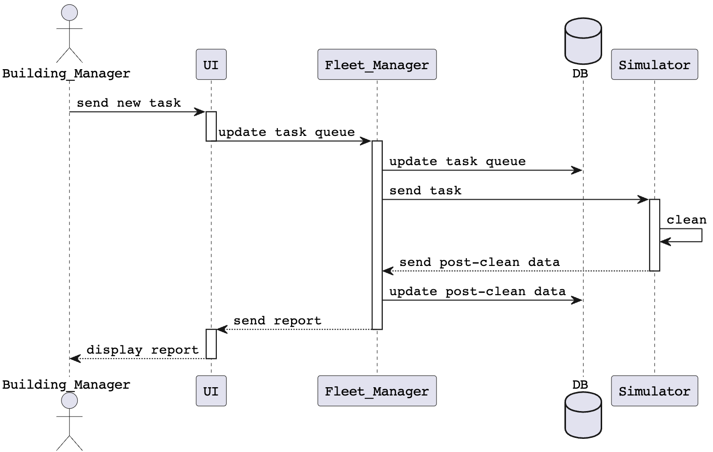
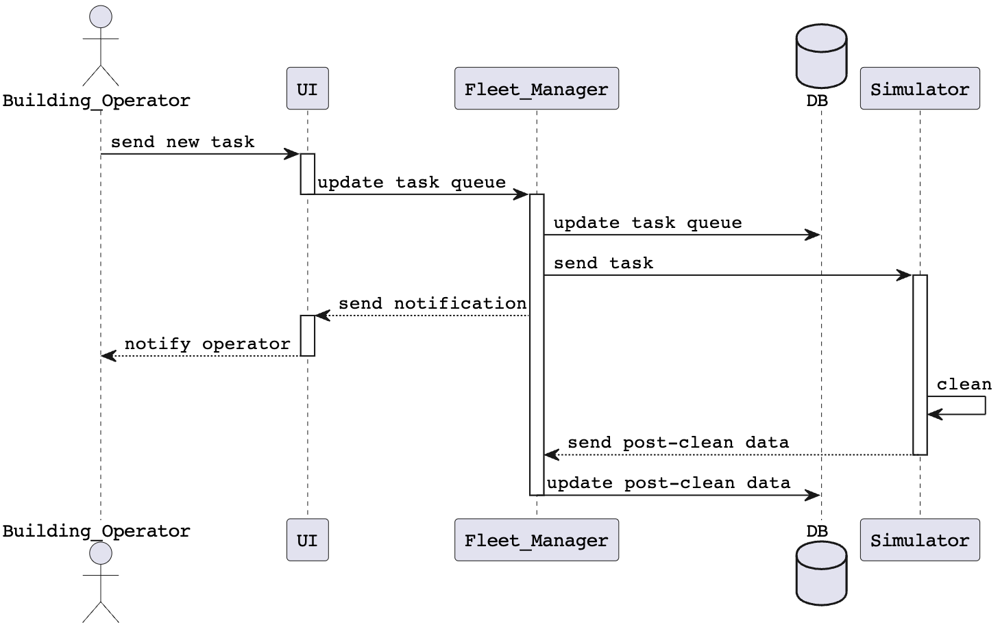

## Sequence Diagrams

### Field engineer

This sequence diagram illustrates the interaction between the field engineer and the four components of the robot fleet management system: the UI, system manager, simulation engine, and database, during a robot maintenance notification. The process begins when the simulation engine detects that a robot requires maintenance and informs the system manager. The system manager then updates the robot’s status in the database. Once the update is complete, the database sends detailed information, including the robot's ID, name, time, and location, back to the system manager. The system manager passes this information to the UI, which displays the maintenance alert to the field engineer.

---

### Senior manager

This sequence diagram shows the interaction between the senior manager and the three system components: the UI, system manager, and database. The process starts when the senior manager requests a business analysis of the robots through the UI. The UI forwards the request to the system manager, which retrieves the robot performance data from the database, analyzes it, and generates a report. The system manager then sends the report back to the UI, which displays it to the senior manager.

---

### Building Manager

This sequence diagram shows the interaction between the building manager and the four system components: UI, Fleet (System) Manager, and Database. The process starts when the building manager wants to update the schedule or the floor plan according to his or her needs. The building manager wouuld then input the new schedule/floorplan into the appropriate compoent of the UI, which will sent the updated data to the fleet manager. The fleet manager will update the new information in the database. Once a task is initiated, the fleet manager will use the new information when it starts the simulation, after which it will sent the data to the fleet manager, which will update the database, and then send the report to the UI where the building manager can see the results of the new simulation, with the appropriately updated floor/schedule.

This sequence diagram shows another interaction between the building manager and the same four system components. The process starts when the building manager wants a new task to be completed, which they will indicate in the UI. The UI will then send that task to the fleet manager, where the fleet manager will update the queue of tasks. This change will be reflected when the simulation begins, which is initiated from the fleet manager. After the simulation is complete, the data is forwarded to the fleet manager, which will update the database, then send the report to the UI where the building manager can see the results of the simulation, which has been appropriately updated with the new task.

---

### Building Operator

This sequence diagram shows the interaction between the building operator and the four system components: UI, Fleet (System) Manager, and Database. The process starts when the building operator wants a new task to be completed, which they will indicate in the UI. The UI will then send that task to the fleet manager, where the fleet manager will update the queue of tasks, then send a notification to the building operator to let them know the task has been initiated. The fleet manager will then send the task to the simulator. After the simulation is complete, the data is forwarded to the fleet manager, which will update the database.