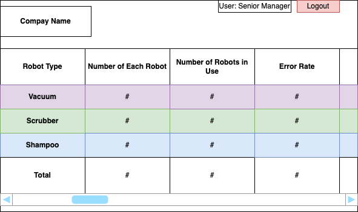
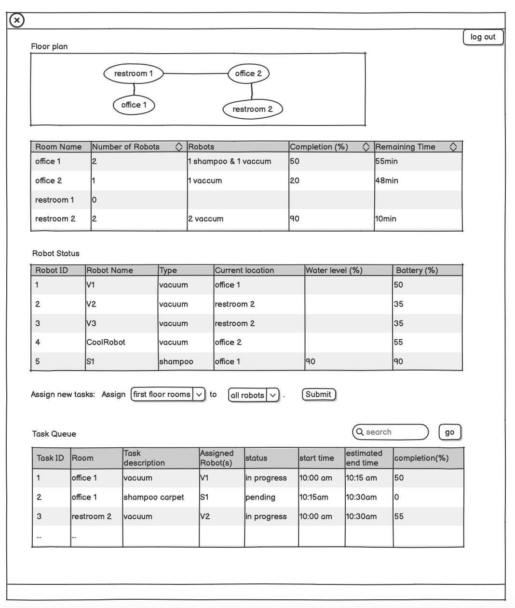

# User Interface Wireframes
There are 4 different user interfaces for each user: senior manager, building operator, building manager and field engineer. 

### **Senior Manager Interface**
This interface provides an overview of the robot fleet and performance metrics for the senior manager. It shows a table that categorizes the types of robots (Vacuum, Scrubber, Shampoo) and tracks the total number, number in use, and their error rates. This interface allows the manager to monitor robot usage and efficiency at a high level.

### **Building Operator Interface**
This interface is designed for direct control of an individual robot, offering task assignment and monitoring of the robot's activities. It also includes a floor plan and room-related information, such as how many robots are currently in a room and what is the completion status of a robot.
- **My Robot** section highlights a specific one robot showing its current location, water level, and battery percentage. The operator can assign tasks directly to the robot using a dropdown menu.
- **Task Queue** provides details on the tasks assigned to the robot, including start/end times and completion percentages.

### **Building Manager Interface**
This interface focuses on managing room cleaning schedules and monitoring robot fleet statuses within the building. The floor plan shows a simple layout of the building with connected rooms. The table shows each room's completion percentage, the number of robots working there, and the remaining time to finish the tasks.
- **Robot Status** section that tracks each robot's name, type, location, and details like water level and battery percentage.
- **Task Queue** enables assigning robots to specific rooms, with a detailed status of each task, including start/end times and completion percentages.

### **Field Engineer Interface**
This interface allows for having the building manager interface and also an error page. The interface allows for managing and resolving errors related to cleaning robots. The interface is divided into two Robot Manager and Error Logs. The Robot Manager allows for the same functions as the building manager. 
- **Errors** section displays a list of robot errors, including the error number, robot ID, time, location, and a brief message.
- **Resolves** focuses on showing resolved issues including the error number, robot ID, time, location, and a brief message.

