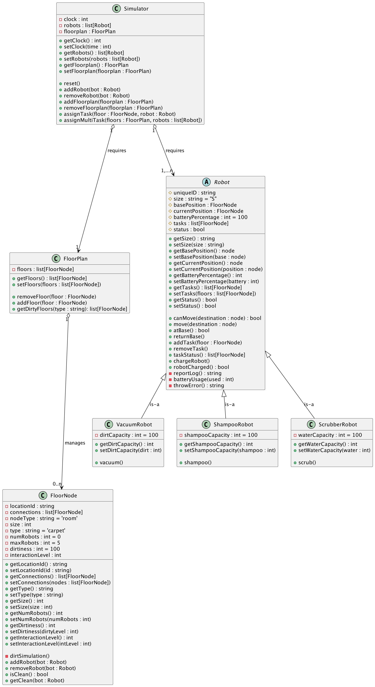
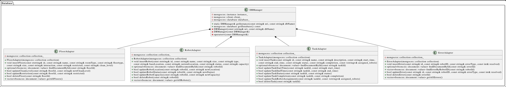
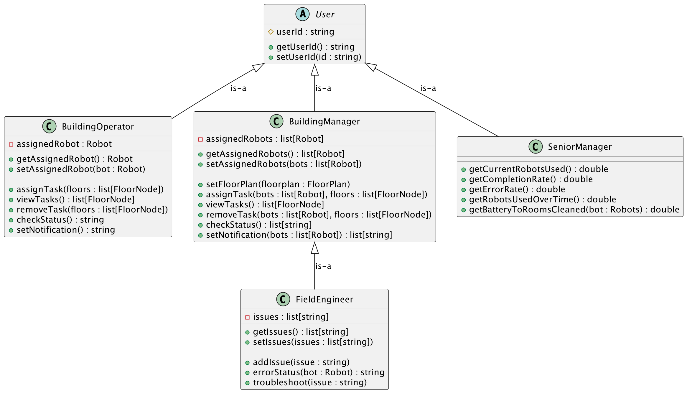
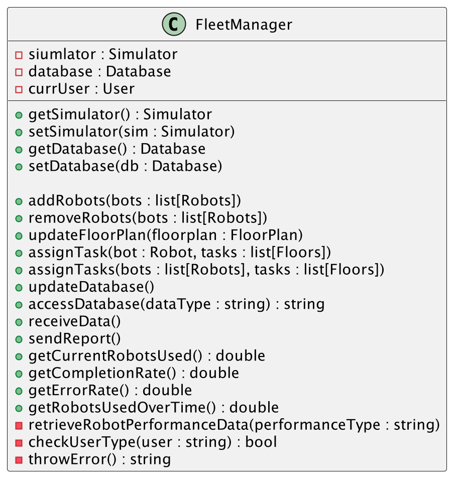

# UML Class Designs
There are four main packages below that represent the different components of the system.

## Simulation Engine

At the very top is the main wrapper of every components of the simulation engine. Simulator is an object that can simulate an environment with a given parameters. However, in order to create a Simulator, it requires a FloorPlan and Robots. 

Following the FloorPlan path, FloorPlan is an object that is a collection of FloorNodes. It can be thought of as a list of FloorNodes, however, it has internal methods to work around the FloorNodes. Then, at the lowest level of this path, FloorNode describes a condition of a room in real environment. dirtSimulation() method depicts the simulation of a real-life scenario of how the floor gets dirty overtime. 

Shifting focus onto Robot class, it is an abstract class where it cannot be a stand-alone object. It needs to be inherited by one of the three types of robots: ScrubberRobot, VacuumRobot, and ShampooRobot. All three robots have different attributes and methods aside from the abstract class attributes and methods.

## Database

Database class is a wrapper class for the MongoDB where its functions will serve the purpose of interacting with MongoDB rather than the management directly accessing MongoDB. Some of the methods include storing/accessing reports/stats and errors.

## Users

At the very top is the abstract class User. It needs to be inherited by one of the followings: BuildingOperator, BuildingManager, SeniorManger, and FieldEngineer. Each of these roles have different methods and attributes aside from their userID. On top of that, FieldEngineer is a child of BuildingManager, meaning it is a BuildingManager as well as some other attributes that FieldEngineer has. 

## Management System

FleetManager is a class that handles the interaction between Simulator, Database, and UI. It has several attributes and methods that interacts with other components and it serves as the core of the system.