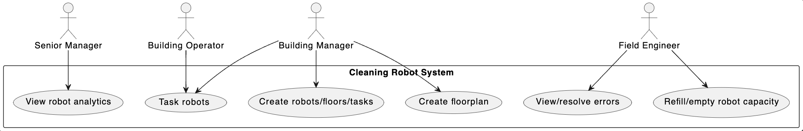

# Use Case Description
The use case diagram shows how the Senior Manager, Building Operator, Building Manager, and Field Engineer interact with a cleaning robot fleet management system. Each user role is associated with specific functionalities in the system to manage and monitor the cleaning robots. The Senior Manager uses the provided robot report to review operational and business analytics from the cleaning activities. The Building Operator interacts with the system by using the interface to task the robots and assign tasks. The Building Manager creates the floors, robots and tasks. By adding each floor, the building manager ultimately creates a floorplan. The Field Engineer uses two use cases: view/resolve errors and refill/empty robot capacity. Some of these use cases, such as tasking robots, may be shared between the Building Operator and Building Manager roles, indicating that multiple roles can control and monitor robot activities.

