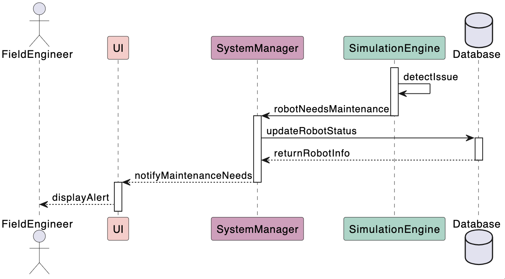
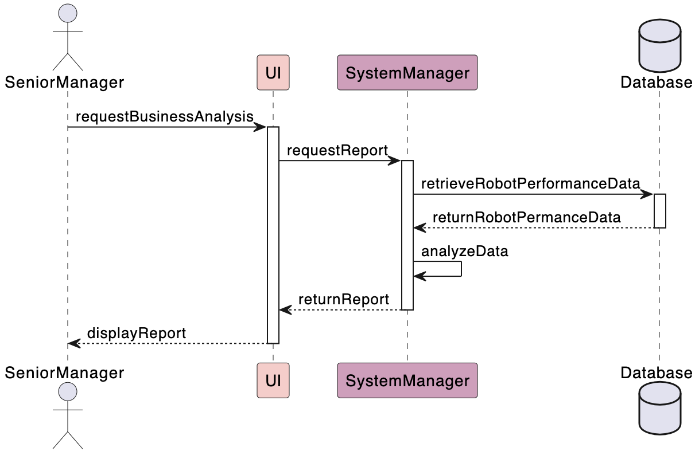

## Sequence Diagrams

### Field engineer

This sequence diagram illustrates the interaction between the field engineer and the four components of the robot fleet management system: the UI, system manager, simulation engine, and database, during a robot maintenance notification. The process begins when the simulation engine detects that a robot requires maintenance and informs the system manager. The system manager then updates the robot’s status in the database. Once the update is complete, the database sends detailed information, including the robot's ID, name, time, and location, back to the system manager. The system manager passes this information to the UI, which displays the maintenance alert to the field engineer.

---

### Senior manager

This sequence diagram shows the interaction between the senior manager and the three system components: the UI, system manager, and database. The process starts when the senior manager requests a business analysis of the robots through the UI. The UI forwards the request to the system manager, which retrieves the robot performance data from the database, analyzes it, and generates a report. The system manager then sends the report back to the UI, which displays it to the senior manager.